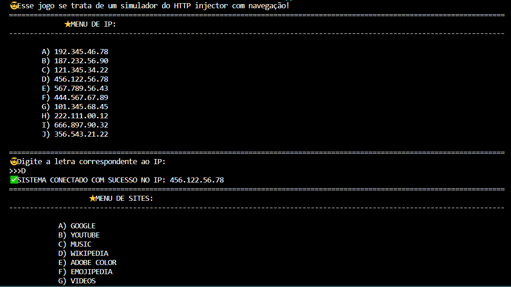

# HTTP INJECTOR - SIMULATOR
👨‍💻ESSE É PEQUENO JOGO QUE RODA NO CONSOLE DA IDE.

 <br>

## DESCRIÇÃO:
Este programa é um simulador interativo de um jogo com temática de HTTP injector e navegação na internet. Aqui está uma descrição mais concisa do que o programa faz:

1. **Configuração inicial:** O programa inicia exibindo uma mensagem de boas-vindas e entra em um loop infinito, criando um menu de IPs disponíveis.

2. **Escolha do IP:** O usuário deve escolher um IP digitando a letra correspondente a partir de um menu apresentado. O programa então gera aleatoriamente um IP associado a uma letra.

3. **Conexão:** O programa simula uma tentativa de conexão, exibindo mensagens de progresso e feedback. Se a escolha do usuário corresponder à conexão gerada aleatoriamente, a conexão é estabelecida com sucesso.

4. **Menu de Sites:** Se a conexão for bem-sucedida, o programa exibe um novo menu com opções de sites. O usuário deve escolher um site digitando a letra correspondente.

5. **Navegação:** O programa simula a abertura do site escolhido, exibe mensagens de progresso e utiliza a biblioteca `webbrowser` para abrir o navegador padrão do sistema com a URL associada ao site escolhido.

6. **Tempo de Conexão:** Após a navegação, o programa conta regressivamente a desconexão, exibindo mensagens de status.

7. **Repetição:** Após a desconexão, o programa retorna ao início do loop, permitindo que o usuário escolha um novo IP e repita o processo.

## EXECUTANDO O JOGO:
1. Execute o código em um ambiente Python.
2. Quando você iniciar o jogo, será apresentado um menu de IPs disponíveis para conexão.
3. Cada IP terá uma letra associada (de A a J).
4. O jogo selecionará aleatoriamente um IP para você conectar.
5. Você deverá digitar a letra correspondente ao IP que deseja usar para conexão.
6. Se a letra digitada corresponder ao IP selecionado pelo jogo, você será conectado com sucesso.
7. Após a conexão bem-sucedida, será exibido um menu de sites disponíveis para acessar.
8. Cada site terá uma letra associada (de A a K).
9. Você deverá digitar a letra correspondente ao site que deseja acessar.
10. Se a letra digitada corresponder ao site selecionado, o site será aberto em seu navegador padrão.
11. Você terá um tempo limitado de conexão (60 segundos). Após esse tempo, você será desconectado automaticamente.
12. Após a desconexão, você terá a opção de tentar novamente ou sair do jogo.
13. Divirta-se explorando diferentes IPs e acessando diferentes sites!

## SOBRE O EXECUTAVEL:
### 1. EXECUTANDO:
- Este arquivo executável está disponível apenas para `Windows X64`. Para executá-lo, basta dar dois cliques. O executável é bastante útil caso o Python não esteja instalado. Trata-se da mesma aplicação do arquivo `CODIGO.py`. Se desejar, você pode recompilá-lo novamente; é para isso que forneci o arquivo `imagem.ico`.

- É importante explicar que ao executar o arquivo executável deste jogo, é possível que o antivírus dispare um alerta de segurança. Isso ocorre porque o jogo abre sites no navegador da web diretamente.

    **Para lidar com isso, há 2 alternativas:**

    1. **Adicionar exceção ao antivírus:** Você pode optar por adicionar uma exceção ao antivírus para permitir que o jogo abra os sites no navegador sem disparar alertas. Isso geralmente pode ser feito acessando as configurações do antivírus e adicionando o arquivo executável do jogo à lista de exceções.

    2. **Executar apenas o `CODIGO.py`:** Uma alternativa é optar por executar apenas o arquivo de código-fonte Python (`CODIGO.py`). Isso evita que o antivírus dispare alertas, já que você e o sistema podem inspecionar o código fonte diretamente.

### 2. GERANDO:
   **1. Instalação do PyInstaller:**
   - Certifique-se de ter o PyInstaller instalado. Se não tiver, instale usando o comando abaixo:
   ```bash
   pip install pyinstaller
   ```

   **2. Gerando o Executável:**
   - Para gerar o executável, utilize o comando `pyinstaller` seguido de opções:
      - `--icon="imagem.ico"`: Especifica o ícone do executável.
      - `-F`: Gera um único arquivo executável em vez de vários.
      - `CODIGO.py`: Substitua "CODIGO.py" pelo nome do seu arquivo Python principal.
   ```bash
   pyinstaller --icon="imagem.ico" -F CODIGO.py
   ```

## NÃO SABE?
- Entendemos que para manipular arquivos em muitas linguagens e tecnologias, é necessário possuir conhecimento nessas áreas. Para auxiliar nesse aprendizado, oferecemos cursos gratuitos disponíveis:
* [CURSO DE PYTHON](https://github.com/VILHALVA/CURSO-DE-PYTHON)
* [CONFIRA MAIS CURSOS](https://github.com/VILHALVA?tab=repositories&q=+topic:CURSO)

## CREDITOS:
- [PROJETO CRIADO PELO VILHALVA](https://github.com/VILHALVA)
